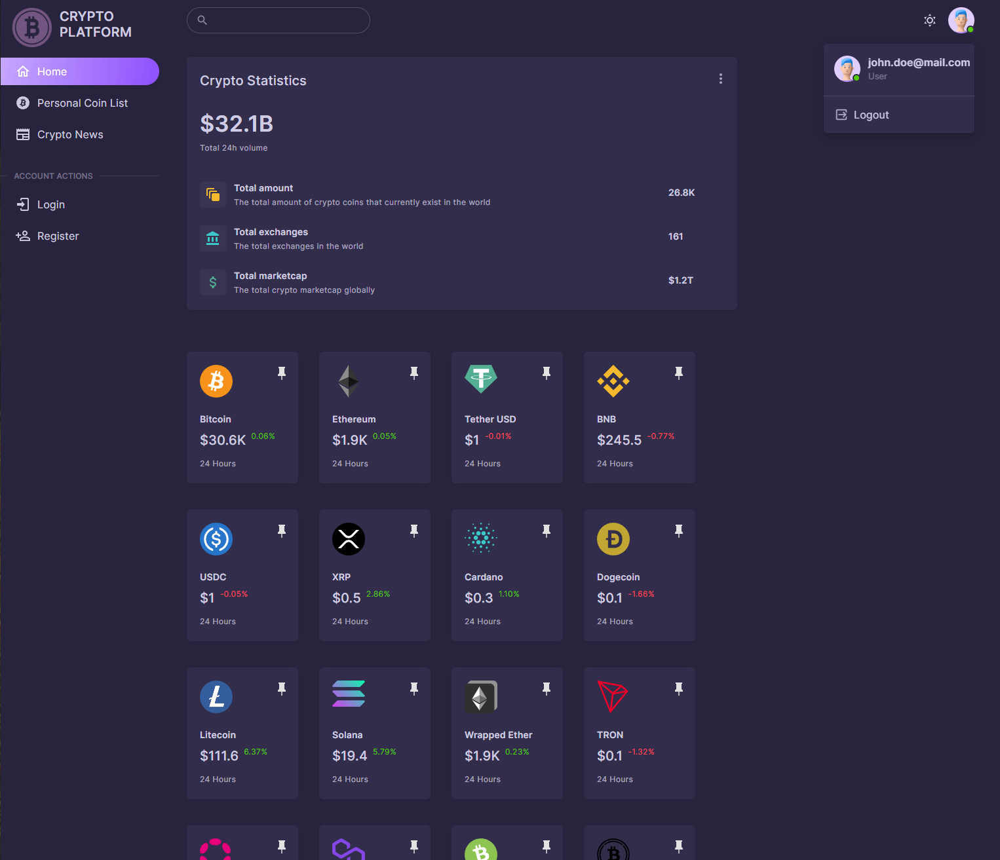
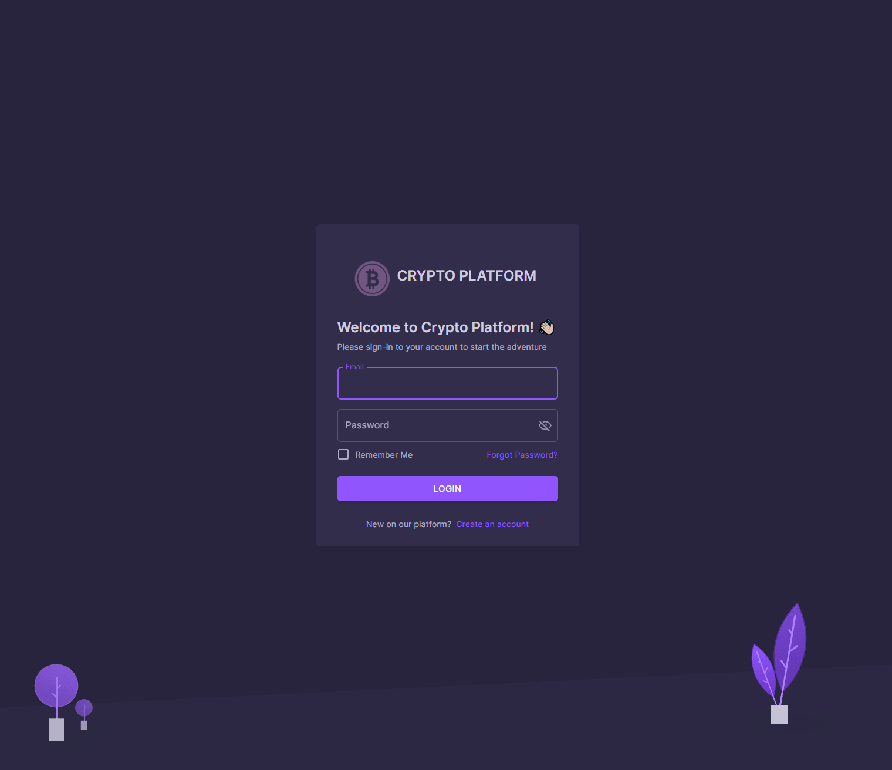
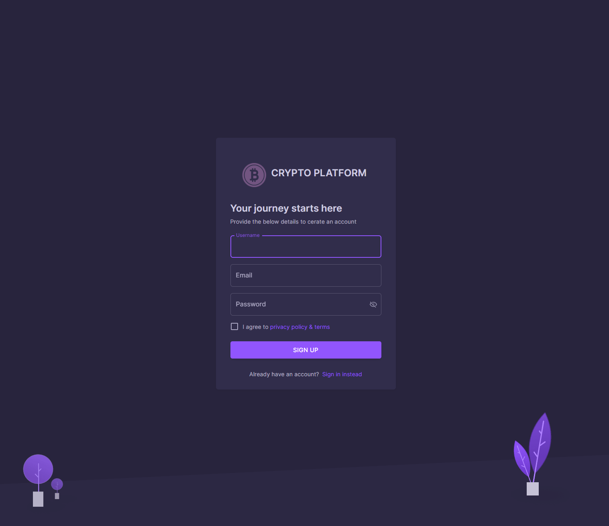

# Crypto platform app

This is a simple crypto platform app. The below images illustrate the basic functionalities, such as data fetching and user authentication using Firebase. The app is built using React, NextJS 12 and Firebase for data-management.

## 1. Coin listing

## 2. Login page

## 3. Registration page

